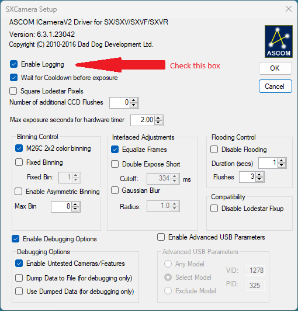

# Reporting Issues

Issues are reported for sxASCOM releases using the Github issue tracking system.

## Enable Logging
The first step in getting an issue fixed is to gather a log file that shows the
problem. The sxASCOM driver contains an option to enable logging which is turned
off by default to avoid filling everyone's disk with unnecessary clutter.
Unfortunately this means that the first time you encounter an issue it will not
be captured in a log.

To enable logging, bring up the sxASCOM configuration dialog using whatever
software you are using to control your camera and then select the "Enable
Logging" box:

Once logging is enabled, open your imaging application and do whatever is needed
to reproduce te problem. A new log file is created for every session (i.e. every
time a camera is connected).

## Reproduce Issue
With logging enabled, connect the camera to the imaging application, perform
the steps required to reproduce the problem, and then disconnect the camera.

Log files are created in:
  Documents\ASCOM\Logs \<date\>\ASCOM.SXCamera.\<timestamp\>

## Review existing Issues
Check out the [open sxASCOM issues](https://github.com/brets-astro/sxascom-releases/issues) to make sure
your issue has not already been reported.

If there is already an issue, please add a comment with any details that you
think might be useful and attach a log file which was gathered while reproducing
the failure in your imaging application. 

## Submit a new issue
If there is not already an issue for your problem, you will need to [create a
new issue](https://github.com/brets-astro/sxascom-releases/issues/new/choose).

In order to allow progress to be made, please describe only one problem in an
issue. If you are seeing multiple problems, submit multiple issues. If they
share a root cause, it is easy for me to combine them. 

Be certain to include a log file with your issue. Remmber that this is a
volunteer effort independent of StarlightXpress, and I depend on users help to
find problems with cameras I do not own.
